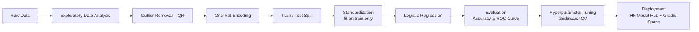

<h1 align="center">❤️ Heart Attack Risk Prediction</h1>
<p align="center"><b>Predicting heart attack risk from clinical measurements using Logistic Regression, with full EDA, outlier handling, and hyperparameter tuning.</b></p>
<p align="center">
    
    
    
    
    
</p>

> ⚠️ **Disclaimer:** This project is for educational/portfolio purposes only. It is **not** a medical diagnostic tool and must not be used for real health decisions. Always consult a qualified physician.

🇹🇷 [Türkçe](README.tr.md) | 🇬🇧 English

---

## **📌 Overview**

Cardiovascular disease is one of the leading causes of death worldwide, and early risk estimation from routine clinical measurements can support — though never replace — professional diagnosis. This project trains an interpretable Logistic Regression model to classify patients as low- or high-risk for a heart attack based on 13 clinical features, and deploys it as an interactive demo.

**🔗 Live demo:** [Hugging Face Space](https://huggingface.co/spaces/KubraParmak/heart-attack-prediction-demo)
**📦 Trained model:** [Hugging Face Model Hub](https://huggingface.co/KubraParmak/heart-attack-prediction-model)

---

## **🗂️ Dataset**

- **Source:** [Heart Attack Analysis & Prediction Dataset](https://www.kaggle.com/datasets/sonialikhan/heart-attack-analysis-and-prediction-dataset) (Kaggle, by Sonia Likhan)
- **Samples:** 303 patient records (298 after outlier removal)
- **Target:** `output` — binary (`0` = low risk, `1` = high risk)
- **Missing values:** none

| Feature | Description |
|---|---|
| `age` | Age in years |
| `sex` | 0 = female, 1 = male |
| `cp` | Chest pain type (0–3) |
| `trtbps` | Resting blood pressure (mmHg) |
| `chol` | Serum cholesterol (mg/dl) |
| `fbs` | Fasting blood sugar > 120 mg/dl (1 = true, 0 = false) |
| `restecg` | Resting ECG results (0–2) |
| `thalachh` | Maximum heart rate achieved |
| `exng` | Exercise-induced angina (1 = yes, 0 = no) |
| `oldpeak` | ST depression induced by exercise |
| `slp` | Slope of the peak exercise ST segment (0–2) |
| `caa` | Number of major vessels colored by fluoroscopy (0–4) |
| `thall` | Thalassemia (0–3) |

---

## **🔄 Project Workflow**



### 1. Exploratory Data Analysis (EDA)
- Inspected categorical features (`sex`, `cp`, `fbs`, `restecg`, `exng`, `slp`, `caa`, `thall`) against the target with count plots.
- Compared numeric feature distributions (`age`, `trtbps`, `chol`, `thalachh`, `oldpeak`) between risk classes with a pairplot, box plots, and swarm plots.
- Explored feature interactions (e.g., exercise-induced angina vs. age, split by sex) with categorical plots.
- Visualized feature correlations with a heatmap.

### 2. Outlier Detection & Removal
Outliers in the numeric features were identified using the **IQR method** and removed row-wise:

```
upper bound = Q3 + 2.5 × IQR
lower bound = Q1 − 2.5 × IQR
```

This reduced the dataset from 303 to 298 samples.

### 3. Encoding & Preprocessing
- Categorical features were one-hot encoded (`pd.get_dummies`, `drop_first=True`) to avoid multicollinearity.
- Numeric features were standardized with `StandardScaler`, **fit on the training split only** and reused on the test split to avoid data leakage.
- Split: 80% train / 20% test (`random_state=42`).

### 4. Modeling
A **Logistic Regression** classifier was trained on the processed features.

| Model | Test Accuracy |
|---|---|
| Logistic Regression (default) | 0.90 |
| Logistic Regression (tuned) | 0.90 |

Model discrimination was also visualized with an **ROC curve**.

### 5. Hyperparameter Tuning
`GridSearchCV` was used to search over the regularization penalty:

```python
param_grid = {"penalty": ["l1", "l2"]}
```

**Best parameter found:** `penalty='l2'` (the scikit-learn default), confirming the baseline configuration was already well-suited to this dataset.

### 6. Deployment
The final model, scaler, and feature schema were serialized with `joblib` and deployed to the **Hugging Face Hub**:
- A **Model repository** hosting the trained artifact and the original notebook.
- A **Gradio Space** providing an interactive UI where users can enter patient measurements and get an instant risk estimate.

---

## **🛠️ Tech Stack**

- **Data analysis & visualization:** `pandas`, `numpy`, `matplotlib`, `seaborn`
- **Machine learning:** `scikit-learn` (`LogisticRegression`, `StandardScaler`, `GridSearchCV`)
- **Model persistence:** `joblib`
- **Deployment:** `gradio`, `huggingface_hub`

---

## **📁 Repository Structure**

```
heart-attack-prediction/
├── heart-attack-analysis-prediction.ipynb  # Full notebook: EDA, preprocessing, modeling, tuning
├── heart_attack_artifact.joblib            # Serialized model + scaler + feature schema
├── app.py                                   # Gradio demo app (same one powering the HF Space)
├── requirements.txt
├── README.md
├── README.tr.md
└── LICENSE
```

---

## **🚀 Getting Started**

### Installation
```bash
git clone https://github.com/KubraParmak/heart-attack-prediction.git
cd heart-attack-prediction
pip install -r requirements.txt
```

### Run the notebook
```bash
jupyter notebook heart-attack-analysis-prediction.ipynb
```

### Run the demo locally
```bash
python app.py
```
This launches the same Gradio interface used in the Hugging Face Space, served locally at `http://127.0.0.1:7860`.

Or just try the [**live demo**](https://huggingface.co/spaces/KubraParmak/heart-attack-prediction-demo) — no installation required.

---

## **🔮 Future Improvements**

- Try tree-based models (Random Forest, XGBoost) for comparison against the linear baseline.
- Use cross-validated metrics (precision, recall, F1, ROC-AUC) instead of a single train/test split.
- Add SHAP-based feature importance to explain individual predictions.

---

## **📄 License**

This project is licensed under the [MIT License](LICENSE).

## **🙋 Author**

**Kübra Parmak**
- GitHub: [@KbrPrmk](https://github.com/KbrPrmk)
- Hugging Face: [@KubraParmak](https://huggingface.co/KubraParmak)

## **🙏 Acknowledgments**

- Dataset by [Sonia Likhan on Kaggle](https://www.kaggle.com/datasets/sonialikhan/heart-attack-analysis-and-prediction-dataset).
