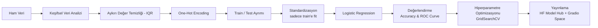

<h1 align="center">❤️ Kalp Krizi Riski Tahmini</h1>
<p align="center"><b>Klinik ölçümlerden Logistic Regression ile kalp krizi riskini tahmin eden; tam EDA, aykırı değer işleme ve hiperparametre optimizasyonu içeren bir proje.</b></p>
<p align="center">
    
    
    
    
    
</p>

> ⚠️ **Uyarı:** Bu proje yalnızca eğitim/portfolyo amaçlıdır. Tıbbi bir tanı aracı **değildir** ve gerçek sağlık kararları için kullanılmamalıdır. Gerçek durumlar için lütfen bir hekime danışın.

🇹🇷 Türkçe | 🇬🇧 [English](README.md)

---

## **📌 Genel Bakış**

Kardiyovasküler hastalıklar dünyada en önde gelen ölüm nedenlerinden biri ve rutin klinik ölçümlerden erken risk tahmini, profesyonel tanının yerini almasa da onu destekleyebilir. Bu proje, 13 klinik özelliğe bakarak hastaları düşük/yüksek kalp krizi riski olarak sınıflandıran yorumlanabilir bir Logistic Regression modeli eğitiyor ve interaktif bir demo olarak yayınlıyor.

**🔗 Canlı demo:** [Hugging Face Space](https://huggingface.co/spaces/KubraParmak/heart-attack-prediction-demo)
**📦 Eğitilmiş model:** [Hugging Face Model Hub](https://huggingface.co/KubraParmak/heart-attack-prediction-model)

---

## **🗂️ Veri Seti**

- **Kaynak:** [Heart Attack Analysis & Prediction Dataset](https://www.kaggle.com/datasets/sonialikhan/heart-attack-analysis-and-prediction-dataset) (Kaggle, Sonia Likhan)
- **Örnek sayısı:** 303 hasta kaydı (aykırı değer temizliği sonrası 298)
- **Hedef değişken:** `output` — ikili (`0` = düşük risk, `1` = yüksek risk)
- **Eksik değer:** yok

| Özellik | Açıklama |
|---|---|
| `age` | Yaş |
| `sex` | 0 = kadın, 1 = erkek |
| `cp` | Göğüs ağrısı tipi (0–3) |
| `trtbps` | Dinlenme tansiyonu (mmHg) |
| `chol` | Serum kolesterolü (mg/dl) |
| `fbs` | Açlık kan şekeri > 120 mg/dl (1 = evet, 0 = hayır) |
| `restecg` | Dinlenme EKG sonucu (0–2) |
| `thalachh` | Ulaşılan maksimum nabız |
| `exng` | Egzersize bağlı anjina (1 = evet, 0 = hayır) |
| `oldpeak` | Egzersizle oluşan ST depresyonu |
| `slp` | Egzersiz zirvesindeki ST eğimi (0–2) |
| `caa` | Floroskopiyle görülen ana damar sayısı (0–4) |
| `thall` | Talasemi (0–3) |

---

## **🔄 Proje Akışı**



### 1. Keşifsel Veri Analizi (EDA)
- Kategorik özellikler (`sex`, `cp`, `fbs`, `restecg`, `exng`, `slp`, `caa`, `thall`) hedef değişkene karşı count plot ile incelendi.
- Sayısal özelliklerin (`age`, `trtbps`, `chol`, `thalachh`, `oldpeak`) risk sınıflarına göre dağılımları pairplot, box plot ve swarm plot ile karşılaştırıldı.
- Özellikler arası etkileşimler (örn. egzersize bağlı anjina – yaş ilişkisi, cinsiyete göre ayrılmış) cat plot ile incelendi.
- Özellikler arası korelasyonlar bir ısı haritasıyla görselleştirildi.

### 2. Aykırı Değer Tespiti & Temizliği
Sayısal özelliklerdeki aykırı değerler **IQR yöntemiyle** tespit edilip satır bazında kaldırıldı:

```
upper bound = Q3 + 2,5 × IQR
lower bound = Q1 − 2,5 × IQR
```

Bu işlem veri setini 303'ten 298 örneğe indirdi.

### 3. Encoding & Ön İşleme
- Kategorik özellikler çoklu doğrusallığı (multicollinearity) önlemek için one-hot encoding (`pd.get_dummies`, `drop_first=True`) ile dönüştürüldü.
- Sayısal özellikler `StandardScaler` ile standardize edildi; scaler **sadece train setine fit edildi** ve test setine sadece transform uygulandı (veri sızıntısı önlendi).
- Ayrım: %80 train / %20 test (`random_state=42`).

### 4. Modelleme
İşlenmiş özellikler üzerinde bir **Logistic Regression** sınıflandırıcı eğitildi.

| Model | Test Doğruluğu |
|---|---|
| Logistic Regression (varsayılan) | 0,90 |
| Logistic Regression (optimize edilmiş) | 0,90 |

Modelin ayırt etme gücü bir **ROC eğrisi** ile de görselleştirildi.

### 5. Hiperparametre Optimizasyonu
Regularizasyon cezası (penalty) için `GridSearchCV` kullanıldı:

```python
param_grid = {"penalty": ["l1", "l2"]}
```

**Bulunan en iyi parametre:** `penalty='l2'` (scikit-learn'in varsayılanı) — bu da varsayılan konfigürasyonun bu veri seti için zaten uygun olduğunu doğruluyor.

### 6. Yayınlama (Deployment)
Son model, scaler ve özellik şeması `joblib` ile serileştirildi ve **Hugging Face Hub**'a yüklendi:
- Eğitilmiş artifact'i ve orijinal notebook'u barındıran bir **Model deposu**.
- Kullanıcıların hasta ölçümlerini girip anında risk tahmini alabildiği interaktif bir **Gradio Space**.

---

## **🛠️ Kullanılan Teknolojiler**

- **Veri analizi & görselleştirme:** `pandas`, `numpy`, `matplotlib`, `seaborn`
- **Makine öğrenmesi:** `scikit-learn` (`LogisticRegression`, `StandardScaler`, `GridSearchCV`)
- **Model kaydetme:** `joblib`
- **Yayınlama:** `gradio`, `huggingface_hub`

---

## **📁 Depo Yapısı**

```
heart-attack-prediction/
├── heart-attack-analysis-prediction.ipynb  # Tüm notebook: EDA, ön işleme, modelleme, optimizasyon
├── heart_attack_artifact.joblib            # Serileştirilmiş model + scaler + özellik şeması
├── app.py                                   # Gradio demo uygulaması (HF Space'i çalıştıran aynı dosya)
├── requirements.txt
├── README.md
├── README.tr.md
└── LICENSE
```

---

## **🚀 Başlarken**

### Kurulum
```bash
git clone https://github.com/KubraParmak/heart-attack-prediction.git
cd heart-attack-prediction
pip install -r requirements.txt
```

### Notebook'u çalıştırma
```bash
jupyter notebook heart-attack-analysis-prediction.ipynb
```

### Demoyu yerelde çalıştırma
```bash
python app.py
```
Bu komut, Hugging Face Space'teki ile aynı Gradio arayüzünü `http://127.0.0.1:7860` adresinde yerel olarak başlatır.

Ya da kurulum yapmadan doğrudan [**canlı demoyu**](https://huggingface.co/spaces/KubraParmak/heart-attack-prediction-demo) deneyebilirsin.

---

## **🔮 Gelecek Geliştirmeler**

- Doğrusal temel modelle karşılaştırmak için ağaç tabanlı modeller (Random Forest, XGBoost) denenebilir.
- Tek bir train/test ayrımı yerine çapraz doğrulamalı metrikler (precision, recall, F1, ROC-AUC) kullanılabilir.
- Bireysel tahminleri açıklamak için SHAP tabanlı özellik önem analizi eklenebilir.

---

## **📄 Lisans**

Bu proje [MIT Lisansı](LICENSE) ile lisanslanmıştır.

## **🙋 Geliştirici**

**Kübra Parmak**
- GitHub: [@KbrPrmk](https://github.com/KbrPrmk)
- Hugging Face: [@KubraParmak](https://huggingface.co/KubraParmak)

## **🙏 Teşekkürler**

- Veri seti: [Sonia Likhan, Kaggle](https://www.kaggle.com/datasets/sonialikhan/heart-attack-analysis-and-prediction-dataset).
